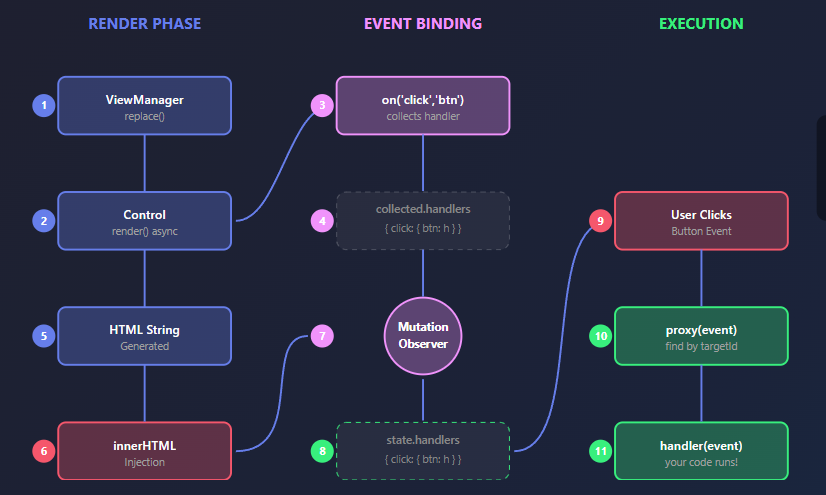
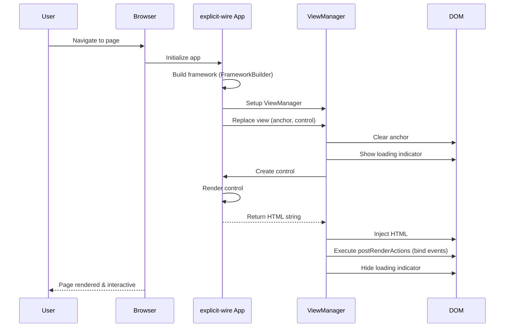
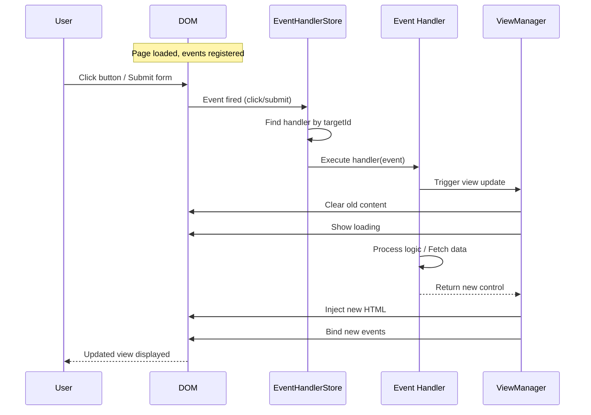
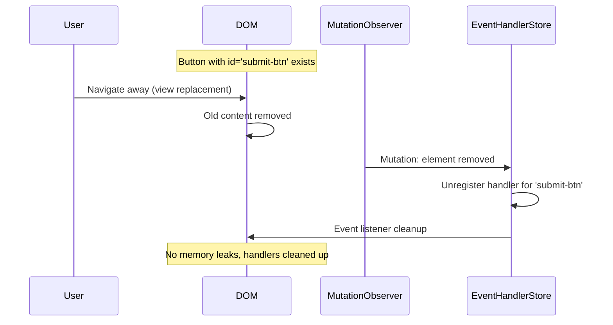

# explicit-wire

**A lightweight UI library**

[](https://www.npmjs.com/package/explicit-wire)
[](https://bundlephobia.com/package/explicit-wire)
[](LICENSE)



---

## Motivation

### The Problem

Modern UI frameworks often hide complexity behind layers of abstraction. For simple web applications — forms, dashboards, content pages — this creates unnecessary overhead:

- **Implicit reactivity** makes debugging difficult
- **Heavy dependencies** bloat bundle sizes for basic functionality
- **Side effects** are hard to trace and predict
- **Learning curves** steep for straightforward use cases

**explicit-wire** provides a thin, clear layer over the browser's native capabilities. No magic, no hidden state, no reactive proxies — just explicit code that does exactly what you write.

### Who Is This For?

Developers building technically simple applications where:

- You don't need to reactively mutate state across dozens of components
- You want full visibility into what happens and when
- Bundle size and zero dependencies matter

---

## How It Works

### Core Concepts

| Concept | Purpose |
|---------|---------|
| **Control** | A component that renders HTML strings (implements `IControl` interface) |
| **ViewManager** | Handles view replacement with loading states and error fallbacks |
| **Event System** | Explicit event subscription with automatic DOM observation |
| **Context** | Simple key-value store for dependency injection |
| **Plugins** | Optional modular features (routing, form handling) |

### Rendering

Controls are simple objects that return HTML strings. The ViewManager injects these into the DOM and executes any post-render actions:

```
Control.render() → HTML String → innerHTML → postRenderActions
```

No virtual DOM. No diffing. Just HTML strings injected directly.

### Events

You explicitly subscribe to events on specific element IDs. The EventHandlerStore uses a MutationObserver to automatically register handlers when elements appear and unregister them when removed:

```
on('click', 'my-button', handler) → waits for element → registers → executes on click
```

This prevents memory leaks and ensures handlers only exist when their targets do.

### Plugins

Extend functionality without bloating core:

- **Router**: URL-based navigation with soft/hard modes
- **onSubmit**: Form submission handling with loading states

---

## Examples

Explore these examples to learn explicit-wire concepts:

| Example | Description |
|---------|-------------|
| [Hello World](./examples/hello-world) | Minimal setup - renders a simple "Hello World!" message |
| [File Upload](./examples/file-upload) | Drag-and-drop file upload with progress bar and event handling |
| [Form Submission](./examples/form-submission) | User management CRUD app with routing and form handling |
| [Layout Shell](./examples/layout-shell) | Dashboard layout with header, sidebar, footer, and dynamic menus |
| [Complex Routing](./examples/complex-routing) | Advanced routing with middleware, role-based access control, and dynamic menus |
| [Data Table](./examples/data-table) | Product inventory table with sorting, pagination, bulk actions, and dropdown menus |
| [Framework Visualizer](./examples/framework-visualizer) | Interactive D3 visualization of render lifecycle and event subscription flow |

Each example includes its own README with instructions on how to run it and what concepts it demonstrates.

## Installation

### Prerequisites

- Node.js (v16 or later)
- npm or yarn

### Install the package

```bash
npm install explicit-wire
```

Or with yarn:

```bash
yarn add explicit-wire
```

### Install development dependencies

For TypeScript projects, you'll need TypeScript and a bundler. The examples use Vite:

```bash
npm install --save-dev typescript vite
```

---

## Quick Start

For a step-by-step guide to building your first explicit-wire application, see the **[Quick Start Tutorial](./QUICKSTART.md)**.

## Best Practices

For comprehensive guidance on using explicit-wire effectively, including patterns for events, routing, rendering, and more, see the **[Best Practices & Recommendations](./RECOMMENDATIONS.md)**.

---

## User Journey Diagrams

### Page Load & Initial Render



### User Interaction Flow



### Element Lifecycle & Cleanup



---

## License

This project is licensed under the MIT License - see the [LICENSE](LICENSE) file for details.
