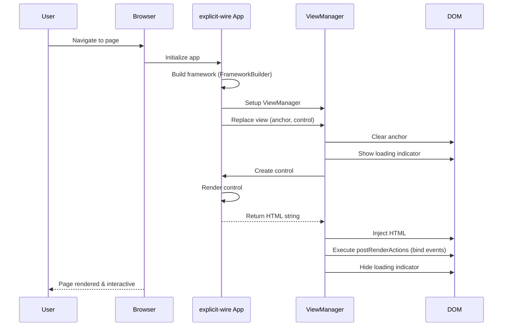
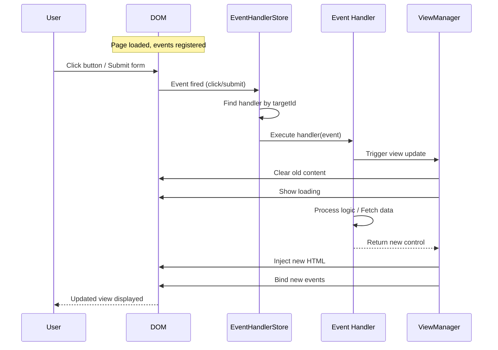

# User Journey Diagrams

## Page Load & Initial Render



## User Interaction Flow



## Element Lifecycle & Cleanup

```mermaid
sequenceDiagram
    participant User
    participant DOM
    participant Observer as MutationObserver
    participant EHS as EventHandlerStore
    
    Note over DOM: Button with id='submit-btn' exists
    
    User->>DOM: Navigate away (view replacement)
    DOM->>DOM: Old content removed
    Observer->>EHS: Mutation: element removed
    EHS->>EHS: Unregister handler for 'submit-btn'
    EHS->>DOM: Event listener cleanup
    
    Note over DOM: No behavior leaks, handlers cleaned up